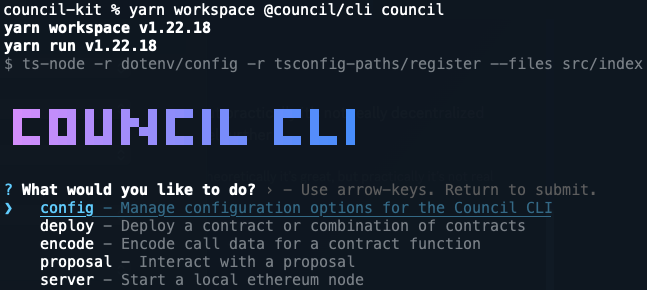
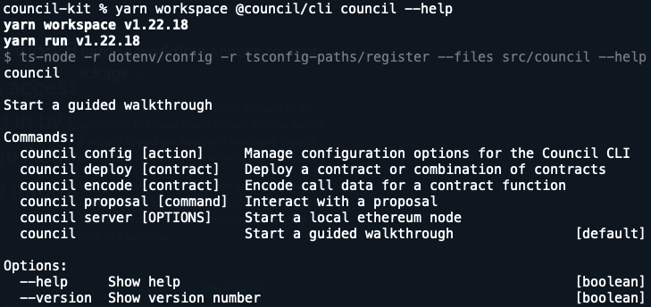
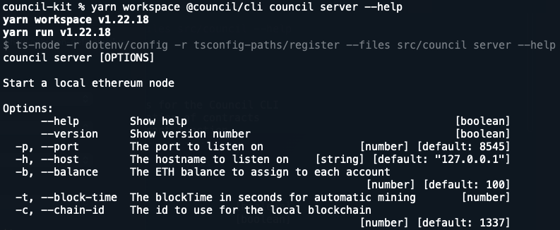
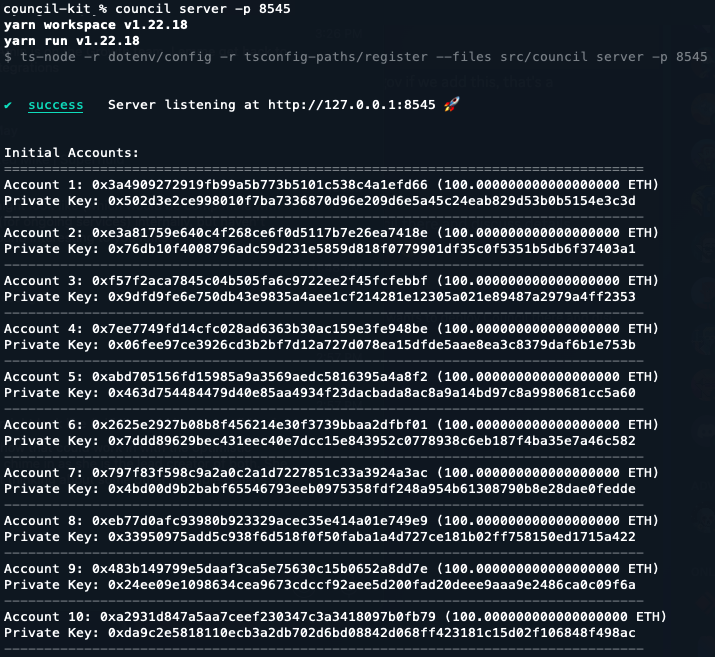

```
█▀▀ █▀█ █ █ █▄ █ █▀▀ █ █     █▀▀ █   █
█▄▄ █▄█ █▄█ █ ▀█ █▄▄ █ █▄▄   █▄▄ █▄▄ █
```

# Council CLI

A CLI for interfacing with the [Council
protocol](https://github.com/delvtech/council).

- [Installation](#installation)
- [Basic Usage](#basic-usage)
- [Help](#help)
- [Deploying a local instance](#deploying-a-local-instance)
  - [1. Start the local server](#1-start-the-local-server)
  - [3. Deploy the contracts](#3-deploy-the-contracts)
- [Creating proposals](#creating-proposals)
  - [1. Encode the function data for the proposed actions](#1-encode-the-function-data-for-the-proposed-actions)
  - [2. Encode the function data to register the call in the Timelock](#2-encode-the-function-data-to-register-the-call-in-the-timelock)
  - [3. Create the proposal](#3-create-the-proposal)

## Installation

The Council CLI isn't currently available as a stand alone package but can be
used directly from the root of the `council-kit` monorepo or installed within the council monorepo.

1. Clone the `council-kit` monorepo.
2. Add `"@council/cli": "*"` to the app or package's package.json.
3. Run install: `yarn`.

## Basic Usage

The easiest way to use the CLI is to call it from within the monorepo:

```
yarn workspace @council/cli council
```

This will show the guided walkthrough which will have you select commands and
prompt for input for the options.



You can also call commands directly without using the prompts.

```sh
# start a local ethereum node server on port 8545
yarn workspace @council/cli council server -p 8545
```

> You will be prompted for input on any required options that are missing from the command.

## Help

You can use the `--help` option to get information on commands, options,
descriptions, and defaults.

```
yarn workspace @council/cli council --help
```



This option can be used at any level of the CLI. For example, to get help on the
`server` command:

```
yarn workspace @council/cli council server --help
```



## Deploying a local instance

The CLI has 2 commands to quickly get a local testnet started and deploy a default version of Council.

### 1. Start the local server

Use the `server` command to start the local testnet.

```
yarn workspace @council/cli council server -p 8545
```

This will start a testnet server hosted at `http://127.0.0.1:8545` and show a list of generated accounts with their private keys and ETH balance.



### 3. Deploy the contracts

Use the `deploy default` command to deploy a default version of the contracts.

```
yarn workspace @council/cli council deploy default
```


## Creating proposals

To create a new proposal in Council, you must know the address of the target
contract(s) that the `CoreVoting` contract will call when the proposal is
executed and the data to call it with. The CLI includes `encode` commands which
can be used to generate the call data for any Council contract and a `proposal` command that can be used
to create and execute proposals.

To understand how it all works, let's walk through an example of creating a
proposal to increase the default quorum to 1.5 million. We'll assume our
deployment of Council is using a timelock contract so we'll also need to
register the call with the timelock.

### 1. Encode the function data for the proposed actions

```
yarn workspace @council/cli council encode core-voting set-default-quorum --power 1500000 --decimals 18
```

This uses the `set-default-quorum` command to encode function data for a
`CoreVoting.setDefaultQuorum` call. The `--power` option is used to define the
new default quorum and the `--decimals` option scales the `--power` value by `10
** decimals`. The resulting call data is:

```
0x7d5709eb000000000000000000000000000000000000000000013da329b6336471800000
```

### 2. Encode the function data to register the call in the Timelock

Since the `CoreVoting` contract needs to go through the timelock to make
any changes to the protocol, we have to use the call data we just generated to encode data for
`Timelock.registerCall`.

```
yarn workspace @council/cli council encode timelock register-call --targets <voting-contract-address> --calldatas 0x7d5709eb000000000000000000000000000000000000000000013da329b6336471800000
```

The `--targets` option is used to identify the contract we want to register a
call to. The `--calldatas` option is used to identify the data we want the
registered call to use when it calls out target. We can use the encoded data we
generated previously.

Replace the `<voting-contract-address>` with an actual address.

This results in the following call data:

```
0x88b49b83dc0bdcecdf6757652124a4cf28d00de01c12935d6fd3113205e645b0abb7cf28
```

### 3. Create the proposal

```
yarn workspace @council/cli council proposal create --address <voting-contract-address> --vaults <space-separated-vault-addresses> --targets <timelock-address> --calldatas 0x88b49b83dc0bdcecdf6757652124a4cf28d00de01c12935d6fd3113205e645b0abb7cf28 --last-call 648000 --ballot yes --wallet-key <wallet-private-key>
```

You can also just use `yarn workspace @council/cli council proposal create` to be prompted for all required options.